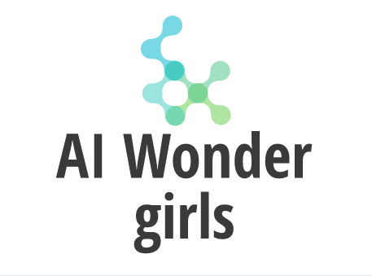
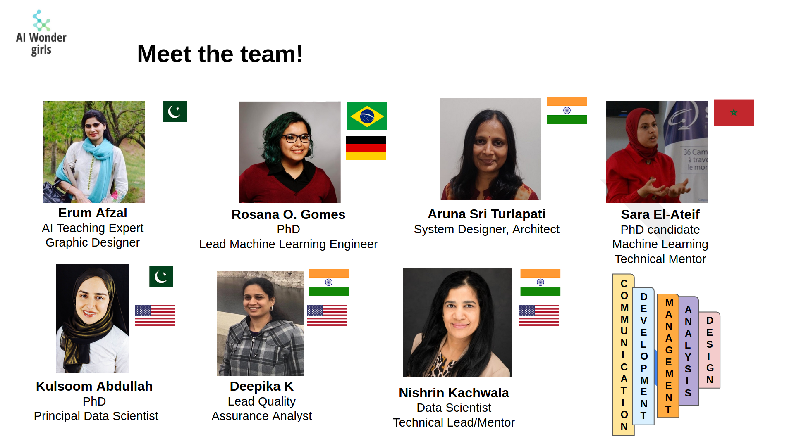
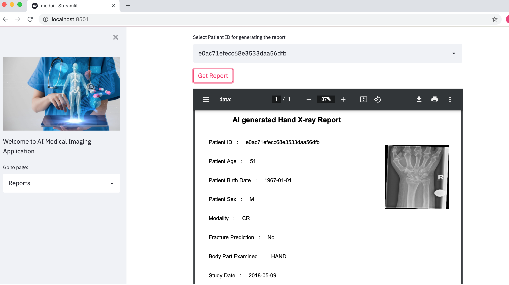
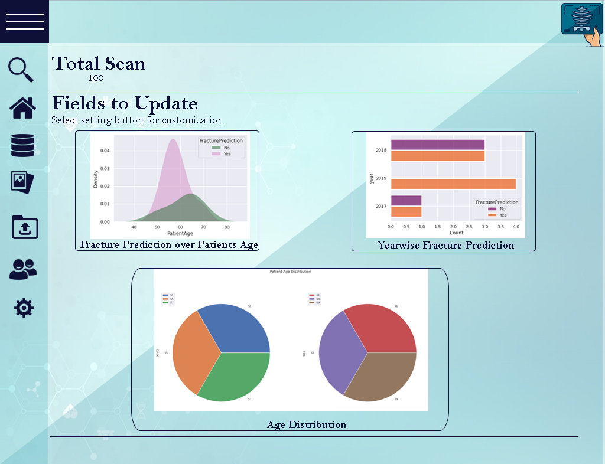
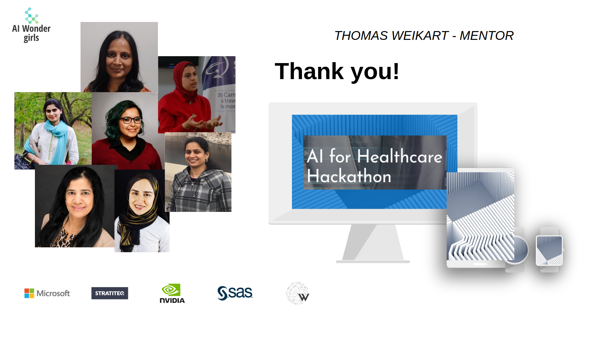

# AI Healthcare Hackathon

Find out more about this project at its [Devpost page](https://devpost.com/software/track-1-challenge-5-medical-imaging-communication-tools?ref_content=my-projects-tab&ref_feature=my_projects).

## Meet the team

This repository contais the work of the **AI Wonder Girls** team! 

## Inspiration 
The **AI wonder Girls** team members are experienced data scientists and are passionate about contributing their skills to Healthcare Domain.

## What our tool does
The AI Medical Imaging application detects wrist fractures, automatically generates reports and displays an analytics dashboard from adaptable configuration capabilities. 

The **implementation** of our batch inference model uses *DenseNet121*. It is an *ImageNet-trained model* using the *MONAI library* on the given data set for wrist fracture images, stored in a database. The model is fine-tuned, then optimized to an accuracy of 80% on the test dataset. The inference pipeline is developed with batch inference and updated in the database. The User interface based on *Streamlit* is developed with the configuration of database and report features used for analytics. A report for each imaging modality is generated automatically using the extracted *DICOM* features and the AI model prediction.

## Challenges we faced
- Understanding the radiology bottlenecks, use cases, and constraints.  
- Creating notifications to multiple devices like SMS, email, mobile, desktop as these communication options do not exist in a single framework that one can use.
- Ensuring data privacy for patients.

## Accomplishments that we're proud of
- Training an AI model for fracture classification with 80% accuracy.
- Developing a pipeline in Python with batch inference.
- Generating Automated medical reports. 
- Building an Application User interface with Streamlit and Python.
- Envisioning a clear strategy for further development of the tool.

And participating in the Hackathon!
 

*Prototype Application: report generation application*

*Potential Application: patient analytics*

## What we learned
Healthcare needs are domain-specific and can vary from organization to organization. Policy and Regulation can also play a role in the way AI is developed and used. 
Domain knowledge input is an essential part of building an efficient AI product. Knowledge in both AI and Healthcare domains can help solve the bottlenecks in the workflows. 

## The pillars of our project

**Innovation:** The application and inference pipeline are built with standard *REST APIs* and *opensource libraries* frameworks which can integrate well with the existing radiology systems like PACS and AI models currently in use. Thus significantly improving the integration of AI into healthcare systems and enhancing the benefits to a larger population. The possible identification of high-risk health problems with this application will allow doctors to prioritize patients and ultimately save more lives.

**Impact:** The AI report generation will ease the bottlenecks in radiology workflowsand ensure faster diagnosis, which is highly desirable in critical health problems.
Hospitals with suitable infrastructure can provide this service to remote places with limited resources by collecting the exams to be studied. AI-generated reports can be processed further with teleconsultations without the patient's need for travel. Meeting demand during a high surge in diagnosis as, in the current covid pandemic, and in countries where healthcare resources are in scarce. 

**Implementation:** The application uses Python, MONAI, DenseNet121, Fastapi, Streamlit, fpdf libraries. The model is trained, optimized, and performs with an accuracy of 80% on the validation dataset. The backend inference engine performs batch inference at timed intervals and updates the database. The Streamlit User Interface connects to the backend engine using the REST APIs to configure, initiate batch inference, get summary data for visualizations and render the exam report.  

**Feasibility:** The UI application, inference pipeline, model are built with python, REST APIs and opensource libraries, frameworks. 

**Extendibility:** One can use the application for other types of diagnostics such as  CT , MRI, Ultrasound, X-ray scans and can be integrated well with PACS and other applications in healthcare practice. To ensure privacy, we built an engine that can run on on-premises servers to ensure privacy. It can handle multiple data sources from within an organization and integrate well within a private cloud with hospitals under an Organization's umbrella.   

## What's next for Track 1 Challenge 5 Medical Imaging Communication Tool
- Extending Notifications beyond simple fractures to critical Diagnostics using AI for the radiologist  
- Expanding to other AI models in practice. 
